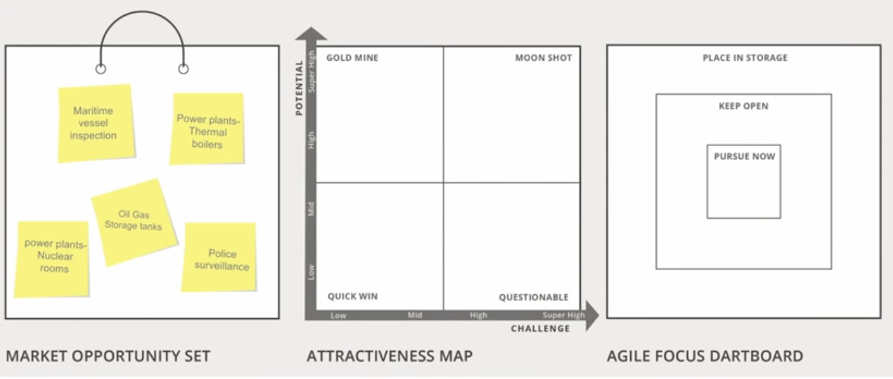
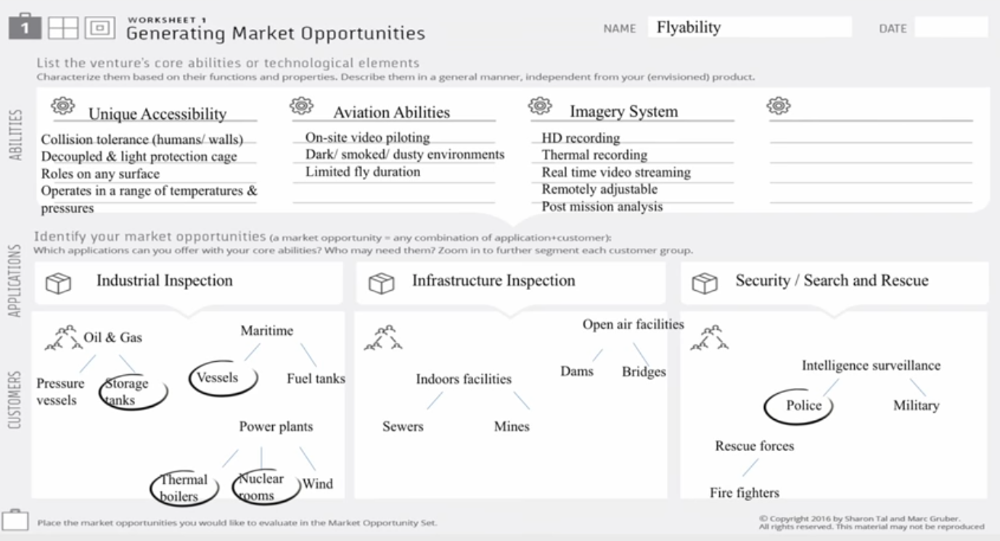
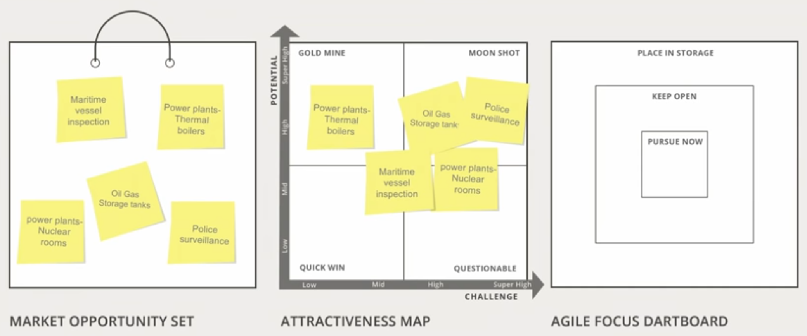
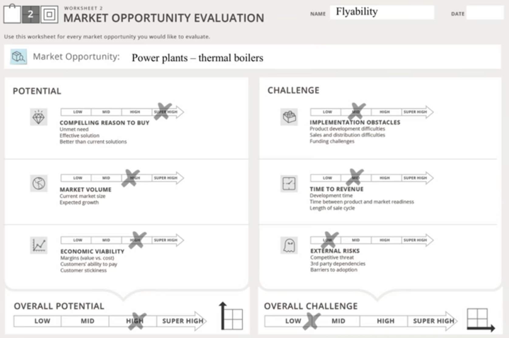
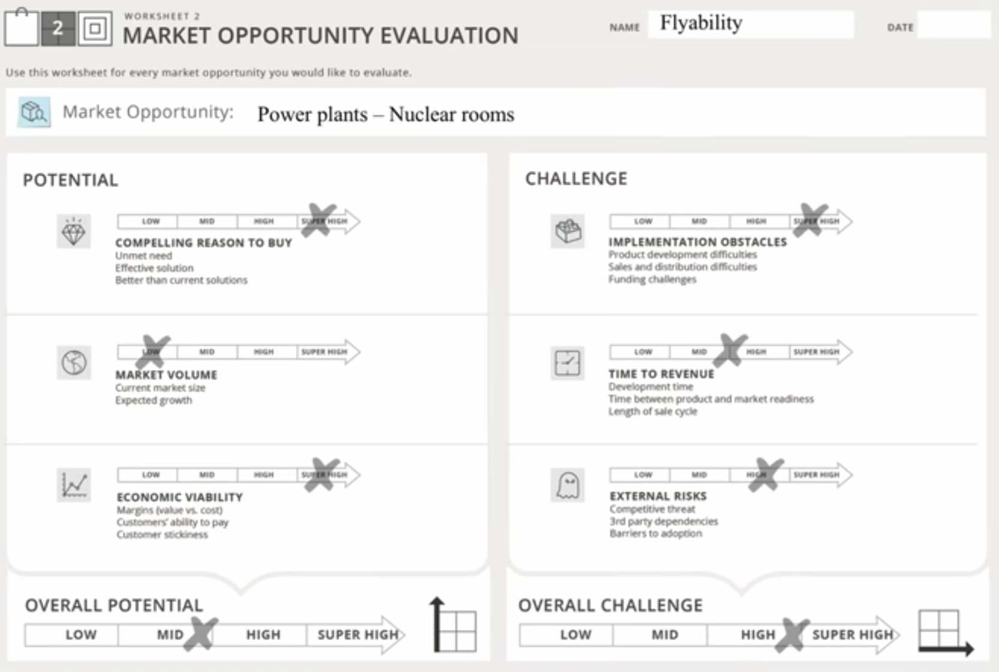
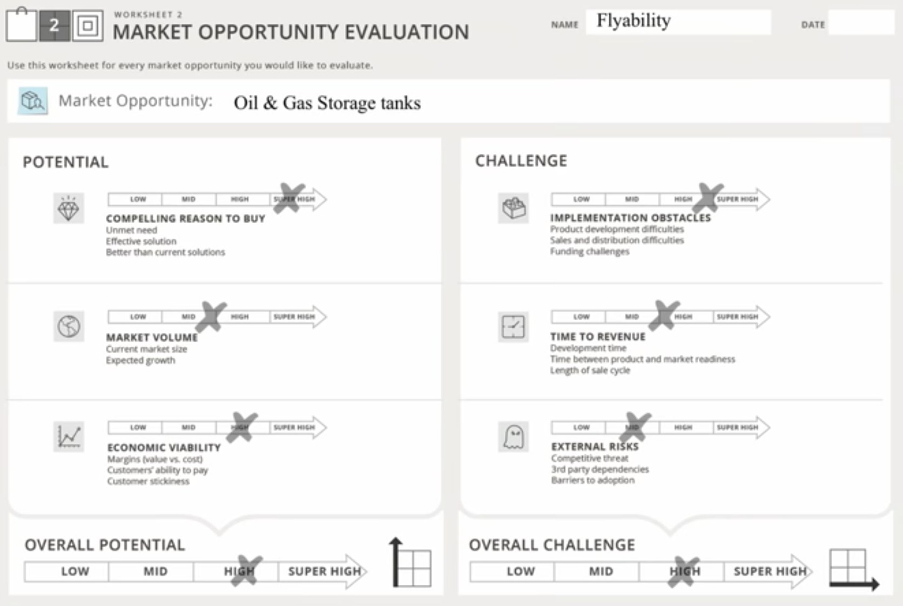
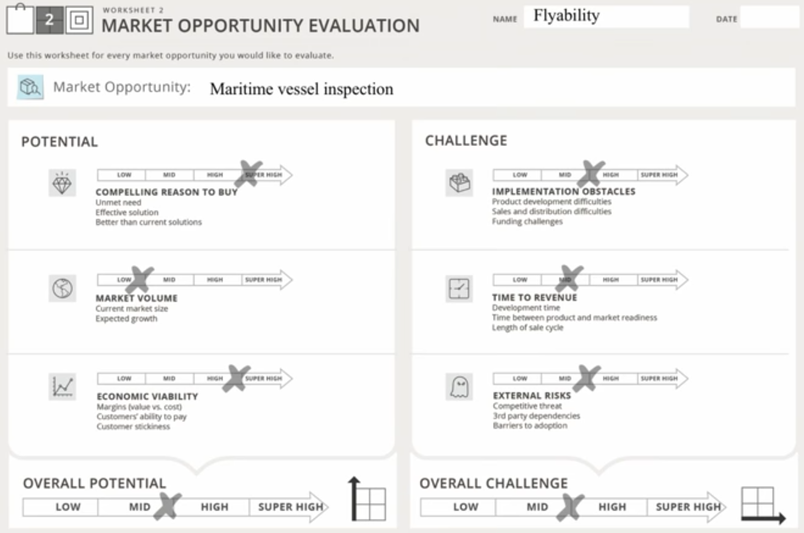
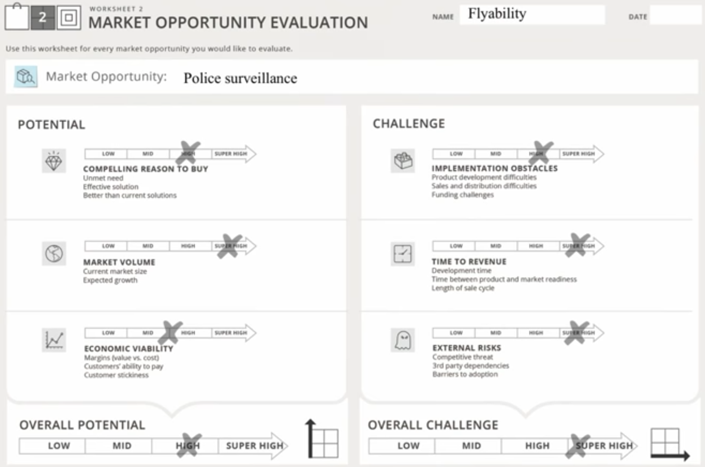
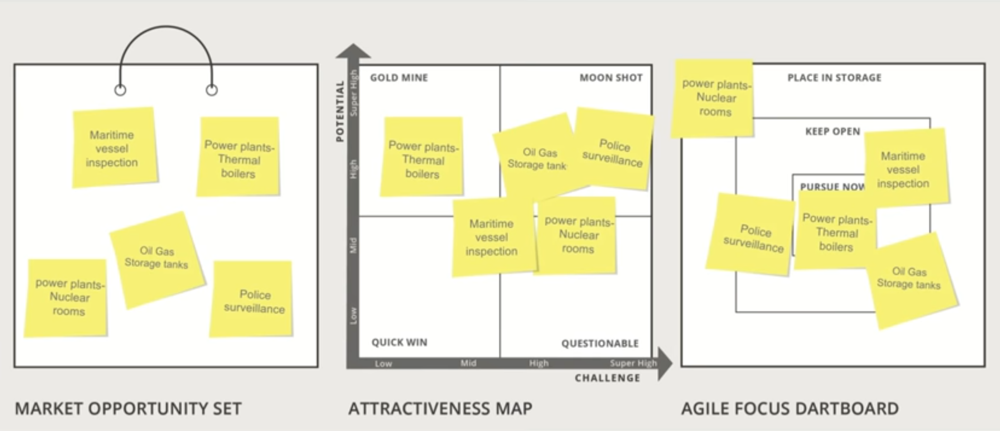
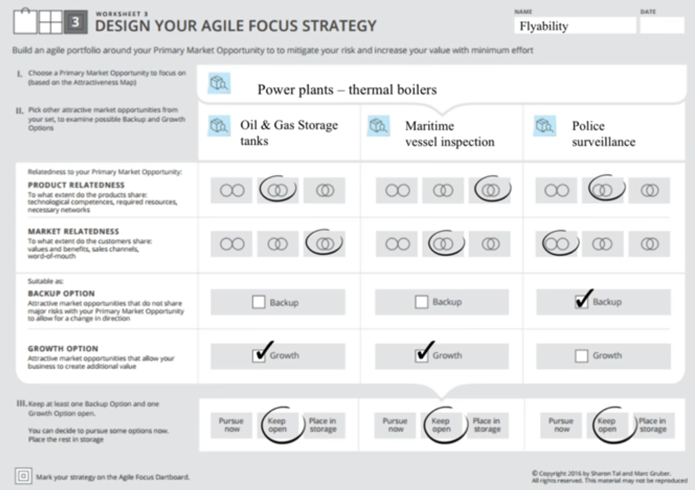

# Market Opportunity Navigator: Fliability
flyability builds safe drones for operating indoors in complex and confined spaces, and in contact with people.

## Market Opportunity Set

### Worksheet 1

## Attractiveness Map

### Worksheet 2 - Market Opportunity Evaluation
#### Power Plants, thermanl boilers

#### Power Plants, nuclear rooms

#### Oil & Gas Storage tanks

#### Maritime Vessel inspection 

#### Police Survillance

## Agile Focus Dartboard

### Worksheet 3

