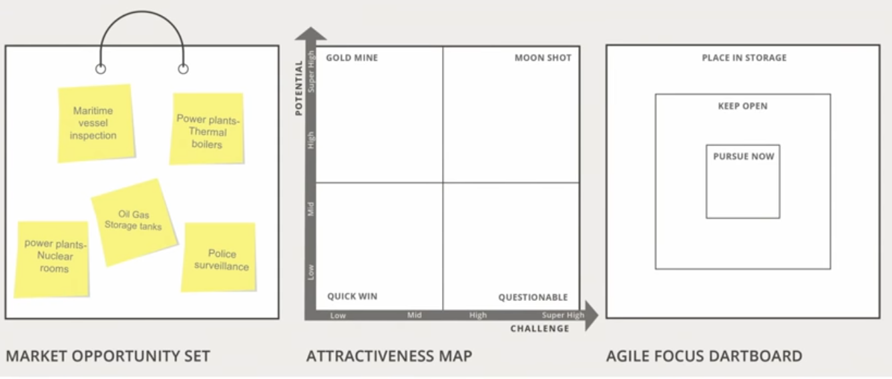

# Week 2 - How to generate your Market Opportunity Set

## 2.1 - Introduction- the Market Opportunity Set

### The manifold opportunities that can stem from a technology
Technologies are fungible: They can be used to create different product or services for different sets of customers.

Every application of your technology, for a specific set of customers, is one market opportunity for your firm

### Look before you leap
Market opportunity choice - a profound decision -> Why?
1. Shapes your chance of success: Market opportunities differ in their attractiveness. Hence, pursuing a promising option provides the fertile ground for growing your business.
2. The decision is imprinting: The markets your pursue will shape many aspects of the venture, such as its identity, its culture, its employees, etc. These have long-term impact and will not be easy to un-do.

Identifying market opportunities is a difficult task
- choose the most attractive option: Don't waste your time with possibly inferior opportunities
- Unleash the power of multiple opportunities to enhance your agility: keep open potential growth and backup options, to avoid lock-in

#### Some research insights
1. Serial entrepreneurs have learned to generate a choice set of market opportunities before deciding which opportunity to pursue intially.
2. Entrepreneurs can derive key performance benefits from the identification of a market opportunity choice set.

Don't fall in love with your initial idea: a market opportunity set is a true asset for your firm

### What we will learn this week
- Describe core abilities independent of any (envisioned) product
- Identify possible applications and customers based on your core abilities
- Create your market opportunity set

#### The Market Opportunity Set
- **What is it?** The set of potential market opportunities that you can address with your core resources and capabilities.
These can be varied options, related to different types of needs for different types of customers.
- **Why is it important?** A varied set of market opportunities is an asset in and of itself, as it increases you chances of having identified the most promising option. It also provides the basis for a plan B (if requried), and for un-locking new growth opportunities over time.
- **Ho is it done** To uncover valuable market opportunities, start with assessing the generic functionalities of your core abilities. Try to understand what other applications are feasible with them... for different types of customers
*Worksheet 1 will guide you through this process*

#### The main take-aways from this stage
- Enhance your cognitive flexibility, to become more alert to other promising opportunities
- Have options at hand, as it gives you the power of choosing, and the power of staying agile
- Leave some long-held assumptions behind (like "this is already the perfect market for me")
- Explore what else may be in store for you!

## 2.2 - What are your unique abilities?

### The de-linking process

Two important stages for generating market opportunities:
- De-linking: describing your uniques abilities independent of any (envisioned) product. Understand your technology in their own right.
- Re-linking: combining your abilities in different ways to create multiple applications and customers. 

**Workshop 1 -> Generating Market Opportunities**
Part 1: List the venture's core abilities or technological elements (resources and those planning to develop)
Part 2: Identify your market oportunities

#### Part 1 - Listing & characterizing your unique abilities
Think about the main buildings blocks of our competences, such as:
- Core technological elements
- Important know-how about a specific process
- A rare resource that you own
- A special capability, etc.

Describe the main properties as well as the functions they can perform in the most generic manner, as they will form the basis for different applications.
This exercise is extremely important not only because it helps you to understand your unique abilities, but also because it helps in developing your **cognitive flexibility**

Examples:
- Augury: we listen to machines https://www.augury.com/
- Biotia: improving the hospital environment https://www.biotia.io/
- Flickr: started as game app with photo sharding, sometimes a feature can be valuable itself https://www.flickr.com/

> What you may currently believe to be just a feature of your (envisioned) product, may turn out to be extremely valuable for other applications, or even in its own right.

## 2.3 - Identifying applications and customers for your unique abilities

### The re-linking process
**Applications and customers**: a market opportunity is any combination of application and customers. Hence, the discovery process encourages you to think broadly on both ends. The link that ties both ends is the need (purpose).

The discovery process: Think out of the Box. Be open. Think unconstrained. Show your creativity. Think broad.

#### Identifying possible applications
An application means a specific usage or function, which you can create with your core technologies and abilities.
It can be based on some, or on all of the key elements you noted in the upper part of Worksheet 1.

Another powerful way to jump-start your imagination is to think about combining your technology with others... and thereby add new functionalities. This may broaden the appeal of your technology to new customer sets.

#### Identifying possible customers
As you uncover potential applications, you should also consider who may have the need for them. These will create your possible sets of customers. Combination of application and customers.

#### Zoom in and out on possible customers
- Zoom-in on potential customer segments to identify sub-segments
- Zoom-out to identify a broader set of users that may open your mind to other segments

#### Boost your discovery skills
- Mine your knowledge, take your time to understand
- Access external sources, talk to people
- Plow lists of industries, systematically check the list
- Perform a patent search

#### Summary
This discovery process is extremely important. Be open and discover as many, and as varied, market opportunities as you possible can. Having 3-5 market opportunities in your Market Opportunity Set is typically a good starting point.
Take your time, this is a very important step for your venture or innovation project.

## 2.4 - The outcome- your market opportunity set
### Continents and countries
Tools until now:
1. Market Opportunity Set
2. Identify possible customers (Worksheet 1)

To set into continents (broad market, vertical) and countries (market segments) we need the right level of abstraction

> Example Augury: diagnose machines or bodies is a continent analysis, and a critical one to begin with, because it is almost impossible to move from one domain to the other.

**Summary** Strive to generate many possible continents and countries, but make sure to pick options on the same level of analysis for consistent Market Opportunity Set.

## 2.5 - Wrap up
### The Market Opportunity Navigator - First step
Put post it notes in the first box: Market Opportunity Set. Gice each market a clear name. 
Having 3-5 options is a good starting point

### Initial Screening
- Does the customer need exist?
- Can we really satisfy the customer's need, using our unique abilities, and better than existing solutions?
- Are there severe restrictions that would hinder us from executing on this market opportunity?
- Will this opportunity be in conflict with any of our core values?

> Example: Augury https://youtu.be/BZB91yS2wOE?t=237 from Generating Market Opportunities, 

This discovery process is extremely important

### Flyability Example

#### Worksheet 1

#### Market Opportunity Set

### Common questions

> Why do some technologies pose a bigger challenge than others when searching for different market opportunities?

Technologies that address the human senses (you can see, feel) and are loosely coupled wit hthe application context are much easier to cross apply  

> When should I stop searching and start my evaluation?

After 3 to 5 opportunities

> What happens if I identify additional opportunities as I move along?

Add them to the opportunity market navigator.

### Assignment 1: Create your Market Opportunity Set
Apply Worksheet 1 and generate your Market Opportunity Set.

Template: Assignment_1_template.pptx

<a href="files/w2/Assignment_1_template.pptx" download>Download Template 1</a>

### A case for assignment 1
FeelIt

### Download Worksheet 1

Worksheet 1 offers a structured process for generating your Market Opportunity Set.

  

