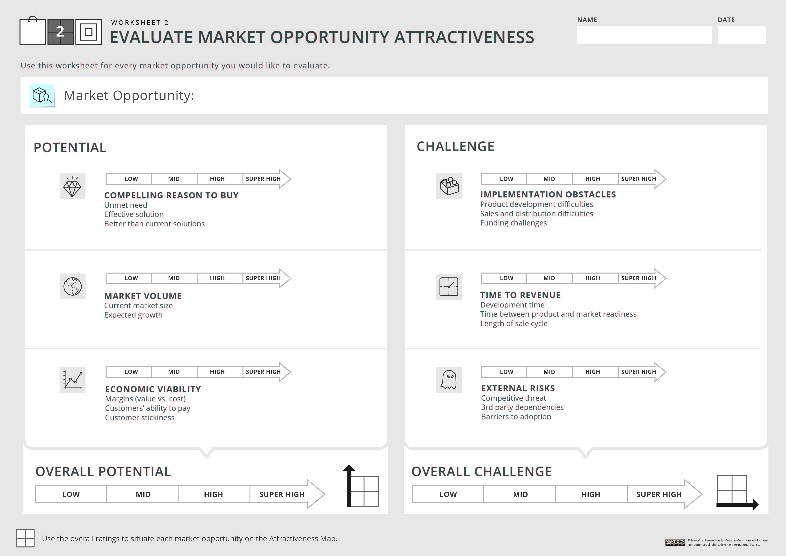

# Week 3 - How to evaluate your market opportunities

We will explain how to assess the attractiveness of your market opportunities following the structured process of Worksheet 2, and how to combine all the bits of information into one clear map. By the end of this session, you will be able to apply worksheet 2 of the Market Opportunity Navigator and to map your opportunities on the Attractiveness Map.

## 3.1 - Introduction- the Attractiveness Map
The importance of opportunity evaluation.

- Recap: What is a market opportunity? Every application of your technology, for a specific set of customers. But when you have a set of options, which one is more valuable and attractive?

#### Evaluating a market opportunity
- how big is the potential of this opportunity?
- how challenge will it be for us to pursue it?
- Market choice is key for creating value and obtaining cash flow
- Market Choice is imprinting your venture in fundamental ways (firm identity, culture, structure, brand name)

#### Evaluating your opportunity is really difficult
- There are always tradeoffs
- There is always uncertainty (normal when bringing innovation to the marketplace), update your data when uncertainty goes away
- The landscape is constantly changing: the Market Opportunity Navigator is designed to be a dynamic tool.

### 3.1.2 - What we will learn this week
- Estimate the value creation potential of a market opportunity
- Estimate the value capture challenge of a market opportunity
- Map your options on the Attractiveness Map (second step from Market Opportunity Navigator)

#### The Attractiveness Map
**What is it?** The Attractiveness Map allows you to visually depict the evaluation of your market opportunities, so you can better grasp their upsides and downsides, and compare them with each other.

**Why is it important?** This visualization helps you in determining your most valuable options, at a given point in time, so that you can make an informed decision about which markets to play in- one that relies less on intuition and suffers less from biases.

**How is it done** You assess the attractiveness of a potential market opportunities by evaluating their value creation potential(y) and value creation challenge(x).
You rate each optio on both dimmensions and then can locate it on the map.

#### An attractive Market Opportunity
- Potential: how big, if worth, value creation
- Challenge: obstacles, risks, difficult level.

Best options high potencial and low challenge.

#### Worksheet 2 will guide you through this process
**Market Opportunity Evaluation**
- Potential: Compelling reason to buy, market volume, economic vialability
- Challenge: Implementation Obstacles, Time to revenue, external risks 

#### The main take-aways from this step
- It's a learning processs: ask the most important questions before making a critical decision
- Figure out the main assumptions that still need to be validated
- Use Worksheet 2 & Attractivess Map to facilitate team discussion
- Key Benefit: The ability to drill down and to see the big picture at the same time

### 3.1.3 - The learning process

The evaluation is one of the most important steps: adopt the learning mindset
- Be systematic in your learning, be consistent.
- Turn hypotesis into knowledge: perform desk research and go out the building and talk with customers and market experts. If feasible, conduct experiments (design thinking, lean startup)
- Get used to uncertainty (known unknown, unknown unknown)

#### What you need to learn
Before you can get to the actual scoring of your options based on their Potential and their Challenge:
1. **Learn about your Customers' World**. Put in their shoes. What is the Value Proposition, what pain are you addressing, why is your solution better than current ones. What do these customers value and what important trends influence them?
2. **Learn about your Business Environment** *Understand the value chain*: string of companies or players that work together to satisfy the market demand for a given product. *Know your competitors*: You will need to understand where you will fit in this value chain, who could stand in your way, and who has an incentive to collaborate with you. Innovative ideas often break existing value chains and change them completely.
3. **Understand your key implementation milestones** what you still need to develop in order to create and deliver your product. What are your resources and capabilities, what you already have and what you still need to develop: tech know-how, human capital, allies and partners, financial resources.

#### Source for Learning
`Desk Research`:
- google analytics and trends
- market studies
- competitors annual reports
- government information
- anything that can help you in building a clearer picture about your business opportunity.

`Get out of the building` and face your market to be able to truly understand it.
 - Target Customer: Personal Interviews & Surveys (what they DO)
 - Trade shows
 - conferences
 - Market experts

#### How to Score your Opportunities?
For each factor that contributes to the Potential or to the Challenge of an opportunity:
- Gather all the information that you can beforehand
- Combine your qualitative and quantitative insights
- Strive to be as objective as possible
- Encourage team discussions

`Don't get frustrated about scoring`:
- Remember that the overall goal is to understand the main upsides and downsides of each opportunity
- You can also refine your scoring over time, as you learn more about each option
- Overall, this process will help you to recognize the patterns and to distinguish between your options, to reveal your most promising opportunity

#### Summary
Take time to research and study, and to gather all the knowledge you can, before you make the fundamental decision of which market(s) to play in.  
Adopt a learning mindset AND accept uncertainty.
Workshop 2 will assist you in evaluating your market opportunities.

### Discussion prompt: Share your experience

## 3.2 - Evaluating the potential of a market opportunity

### 3.2.1 - How to estimate the potential of an opportunity
An attractive Market Opportunity: Potential and Challenge.
Worksheet 2: Market Opportunity Evaluation

#### Value Creation Potential
The potential of a market opportunity is shaped by three primary factors:
- 1) Compelling reason to buy: Will someone really want our offerand be willing to pay for it?
- 2) Market Volume: How big is this market, now and in the near future.
- 3) Economic Viability: Is it worthwhile from a business perspective to pursue this market?

#### 1) Compelling reason to buy
`low -> mid -> high -> super high`

How to evaluate? Look deeply into three important questions:
- Is there a real unmet need?
- Can we provide an effective solution to this need?
- Can we address it better than current solutions?

Why would customers prefer your product? Are the advantages of your solution really meaningful for your customers.

*Important to Remember*: The only way to score this factor is to look through the eyes of your customers: It's now what you think, it's what they think- what they say and what they do.
Validate your believes, go out of the building and talk about this market opportunity with as many potential customers as possible.

#### 2) Market Volume
`low -> mid -> high -> super high`

How to evaluate? Look deeply into two important questions:
- What is the size of the current market?
- How much is it expected to grow over time? 
 
A market which is not significantly big may still be an interesting option, especially if it can serve as a stepping stone towards a larger market that will be exploited in the future.

*Important to Remember*: You can measure the size of a market (We recommend to break down the size of the market into two element- units and dollars) in a top down or bottom up approach. For completely new markets - that have no customers, no competitors, and no products yet - measuring the size of the opportunity is more of a ´guesstimation´ than an exact evaluation.

Steve Blank suggests that there are three main types of markets- existing, resegmented, and new.

#### 3) Economic Viability
`low -> mid -> high -> super high`

How to evaluate? Look deeply into three important questions:
- Do you have a sizeable margins? price - cost of product
- Are the customers well-funded enough to pay the price?
- How sticky will customers be? rebuy, switch to other alternatives

*Important to Remember*: Make sure that you have enough slack between the cost of your offer and how much customers are willing to pay for it. Talk with your 'economic buyers' to understand their perspective, and search for comparable offers that can serve as a signal for how much you can charge for your offering.

#### Potential - the overall rating
- Combine the ratings of the three key factors into an overall score
- You can assign different weights to different factors, but if you do so - make sure to be consistent across options

#### Summary
Assessing the potential of a market opportunity is critical to your evaluation because it allows you to understand the value that could be created by exploiting this opportunity.

While the average potential score enables you to easily distinguish between your options, it may also hide some important information regarding the key upsides or downsides of the market opportunity.
However, by now you should be clearly familiar with the main advantages and disadvantages of your opportunity and that is actually the main goal of this analysis.

### 3.2.2 Augury’s case study
- Market Opportunity Set: 5 options
- Market Opportunity Evaluation: HVAC for commercial buildings -> Overral Potential

## 3.3 - Evaluating the challenge of a market opportunity
How to estimate the value capture challenge of an opportunity

### 3.3.1 - How to estimate the challenge of an opportunity
- Workshhet 2: Market Opportunity Evaluation

#### Value Capture Challenge
The challenge associated with a market opportunity is shaped by three primary factors:
- 1) Implementation Obstacles: How difficult will it be for you to create and deliver your offer? Estimate the resources and capabilities
- 2) Time to Revenues: How long it will take until you can generate cash flow through sales?
- 3) External Risk: What obstacles in your business environment can stand in your way?

#### 1) Implementation Obstacles
`low -> mid -> high -> super high`

How to evaluate? Look deeply into three important questions:
- How difficult will it be for you to develop the product? technology, ui, regulation
- How difficult will it be for you to access the market? distribution channel, time and money need it to build a channel
- How challenging will it be for you to raise funding for this option?

*Important to Remember*: Delivering the offering may sometimes be much more difficult than creating it, so pay careful attention. Adopt a bottom-up analysis to gauge the financial resources required for creating and delivering the offering. Budget and effort required for: Marketing, sales department.

#### 2) Time to Revenues
`low -> mid -> high -> super high`

How to evaluate? Look deeply into three important questions:
- What is the estimated time for development?: milestones until the product is ready for the market
- Will we need to wait until the market is ready for our offer?: value chains elements, infrastructure, complementary products. Time gap between product and market readiness
- How long is the sale cycle expected to be?: people required to meet to make a sale resistance, gatekeepers, estimated time to make a sale. Estimated deployment time once the sale is close.

*Important to Remember*: Although "time to revenues" is tightly related to implementation obstacles, they emphasize two different perspectives that are both important when seeking to understand the underlying challenges of a market opportunity.
Also note that revenues are only one key element to measure success in adoption.
If your startup has different success metrics such as a certain level of traction for example, you can use it to estimate the required time for adoption.

#### 3) External Risk
`low -> mid -> high -> super high`

How to evaluate? Look deeply into three important questions:
- How threatened are you by competition?: who are they, who may become one, how strong are they, do you have a sustainable competitive advantage over them?
- How dependent are you on other companies or players?: who else needs to innovate, ecosystem players, polycemakers or regulators.
- How susceptive are you o adoption barriers?: Are customers receptive to innovation? is your product compatible with existing ways of doing things? can it easily be adopted?

*Important to Remember*: When assesing external risks associated with the competition, consider the extent to which you have competitive advantage vis-a-vis competing firms. The greater that advantage is, the better your competitive situation. As for adoption barriers, remember that some markets adopt innovation more easily than others, and that some innovations are more easily adopted than others.
Remember that external risk can really be a nerve-wracking element in innovation.
In particular, strong competition is often emphasized as a key hazard in the business
literature.
Yet, while entering the fortified field is definitely dangerous, the lack of competition
may be equally worrisome either the market opportunity you are envisioning is not for
real, or the lack of competition means that you will carry the burden of educating the
market and of supplying the complementary elements.

#### Challenge - the overall rating
- Combine the ratings of the three key factors into an overall score
- You can assign different weights to different factors, but if you do so - make sure to be consistent across options

#### Summary
Remember that the important goal here is not scoring itself, but that you have gone through all the major considerations for evaluating the challenges of a market opportunity.

### 3.3.2 Augury’s case study
- Market Opportunity Set: 5 options
- Market Opportunity Evaluation: HVAC for commercial buildings -> Overral Challenge

### 3.3.3 - Key scoring considerations

#### Scoring is Challenging
Scoring your different market opportunities is both a learning process and a validation process. It usually begins with assumptions that you hold about a market and as your knowledge accumulates, your understanding relies on an increasing amount of facts.
Use Worksheet 2 to generate your key assumptions and to set your key action items for validating them.
Even if you feel confident with gathering all possible information, assigning a score to the different factors is not a trivial task.

#### Key Scoring Considerations
- Raising the questions vs finding the answers: Entrepreneurs and innovators often get frustrated when seeking to find satisfying answers to market-related questions. **Ask the right questions**
- Absolute vs relative analysis: We recommend that you start assessing an opportunity as a standalone option and score it in absolute terms but then also think more widely on how it is rated relative to the other options
- Quick & dirty vs thorough analysis: make a quick and dirty evaluation of your opportunities based on your assumptions, use this data to find out what is the critical information that you still need to gather so that you can convert your hypothesis and beliefs into knowledge. In any case, make sure to perform a thorough analysis before you take any action and base this far-reaching decision on a solid evaluation.
- Qualitative vs quantitative scoring: we urge you to think about the assessment in a more qualitative manner through systematic analysis of the different factors. Try to understand the major pros and cons of a market opportunity and rate its value creation potential and value capture challenge accordingly.
- Short vs Long term horizon: large organization or quick exit, be consistent in your approach when assessing all the options in your market opportunity set.

#### Summary
if you are not sure how to score the different factors you can rest assure that
you have not missed any important consideration.

## 3.4 - The outcome- your Attractiveness Map
### 3.4.1 - Mapping your options on the Attractiveness Map
The market Opportunity Navigator:
1. Market Opportunity Set: evaluate each market opportunity
2. Attractiveness Map: potencial and challenge axis
3. Agile Focus Dashboard

Market Opportunity Evluation Augur:
- Manufacturing Machines: Overall -> Potential[high-super] | Challenge[high]
- Cooling Containers: Overall -> Potential[mid-high] | Challenge[mid]
- White appliances: Overall -> Potential[high] | Challenge[high]
- Car manufacturers: Overall -> Potential[superhigh] | Challenge[superhigh]

#### What Can We Learn from the Attractiveness Map
- Analyzing each individual market opportunity
- Analyzing the set of market opportunities
- Choosing a preferred market opportunity: By zooming in on each individual market opportunity and then zooming out on the whole set of options,

### 3.4.2 - The different quarters of the Attractiveness Map
There are 4 zones:
- 1) Quick Win
- 2) Gold Mine
- 3) Moon Shot
- 4) Questionable

#### 1) Gold Mine
- Market opportunities with relative high potential and low challenge
- They are ideally located but relatively rare
- Usually result of identify a significant unmet need that no nes has addressed before. Or by possessing unique know-how to overcome a challenging hurdle that others simply cannot overcome.
- A gold-mine opportunity has the features that would make it your primary market opportunity.

#### 2) Moon Shot
- Market opportunities with relatively high potential but also high challenge.
- Truly innovative offers are usually located in this quarter, bearing high risk and high returns simultaneously.
- Most interesting options to invest in.
- May fit as your primary market opportunity, or as a long-term growth option

#### 3) Quick Win
- low potential and low value challenge.
- They represent the low-risk, low return alternatives. They offer limited value creation potential that is relatively safe.
- These options may offer a great jump-start, and may be combined with other opportunities to enhance the long term potential of the firm.

#### 4) Questionable
- low potentia land high challenge
- keep them in mind, as conditions may change over time
- Many venture projects fail because they pursue a questionable opportunity, often without even being aware of that. Number one reason for failure was that the startups primarily addressed problems that are interesting to solve rather than problems that serve a market need.

#### Shapping an Opportunity to Improve its Location
Improving the potential of a market opportunity:
- For example, try to increase demand by re-segmenting your market, aim for a segment that feels a stronger pain, or is simply significantly larger.

Improving the challenge of a market opportunity:
- For example try to decrease your risks through strategic partnerships, cooperating with nother player in the value chain

#### Summary
Use these distintive quarters to easily discriminate between your options, and to grasp their differences.
The map allows you to compare potential market opportunities, to locate the most promising options, and to start designing your Agile Focus Strategy

### Discussion prompt: Opportunities across the attractiveness map
Give examples of market opportunities that are located in one of the four quarters of the Attractiveness Map: 
- Gold mine
- Moon shot
- Quick win
- Questionable
Explain why you think this opportunity is located in a specific quarter.

## 3.5 - Wrap up
### 3.5.1 - Flyability example
market opportunity set: 
- inspection of boilers and heaters in thermal power plants,
- inspection of nuclear rooms in power plants, 
- inspection of storage tanks in the oil and gas industry, vessel 
- inspection in the maritime industry
- intelligence and surveillance for police forces.

`low | mid | high | super high`

Market Opportunity Evaluation: Power Plants, thermanl boilers.  
1. Potential [high]
  - Compelling Reason to Buy [super-high]
  - Market Volume [high]
  - Economic Viability [high]
2. Challenge [low-mid]
  - Implementation Obstacles [mid]
  - Time to Revenue [mid]
  - External Risks [low]
[*] Overall this is an attractive market opportunity located in the goldmine quarter of the atractiveness map.

Market Opportunity Evaluation: Power Plants, nuclear rooms.  
1. Potential [miD-high]
  - Compelling Reason to Buy [super-high]
  - Market Volume [low]
  - Economic Viability [super-high]
2. Challenge [miD-high]
  - Implementation Obstacles [super-high]
  - Time to Revenue [mid-high]
  - External Risks [high]
[*] Overall this market opportunity is located between the moonshot and the questionable quarters of the attractiveness map.

Market Opportunity Evaluation: Oil & Gas Storage tanks.  
1. Potential [high]
  - Compelling Reason to Buy [super-high]
  - Market Volume [mid-high]
  - Economic Viability [high]
2. Challenge [high]
  - Implementation Obstacles [high-super-high]
  - Time to Revenue [mid-High]
  - External Risks [mid]
[*] Overall this market opportunity is located on the moonshot quarter of the attractiveness
map.

Market Opportunity Evaluation: Maritime Vessel inspection 
1. Potential [miD-high]
  - Compelling Reason to Buy [super-high]
  - Market Volume [low-mid]
  - Economic Viability [high-super-high]
2. Challenge [mid-high]
  - Implementation Obstacles [mid-high]
  - Time to Revenue [mid]
  - External Risks [mid-high]
[*] Overall this market opportunity is located right at the middle of the attractiveness map with no clear location in any quarter.

Market Opportunity Evaluation: Police Survillance
1. Potential [high]
  - Compelling Reason to Buy [high]
  - Market Volume [super-high]
  - Economic Viability [mid-high]
2. Challenge [super-high]
  - Implementation Obstacles [high]
  - Time to Revenue [super-high]
  - External Risks [super-high]
[*] it is located in the moon-shot quarter of the attractiveness map.

### 3.5.2 - Common questions

- Are these the only parameters that one should consider when evaluating a market opportunity? Are there others? Notably, there are some additional factors that do not influence these two dimensions but that may influence your final choice such as your own values, aspirations, passion. We will elaborate on these factors in week where we discuss how to choose your primary market opportunity.

- My goal is quick exit so some of my parameters are different -what should I do?  Your evaluation parameters may change, so feel free to add or to revise some factors according to your goal, make sure to be consistent and rate all your opportunities based on the same parameters

- Prior experience of the founders in specific market is a very important parameter. Why is it missing in the evaluation? prior experience provides customer understansing and better network, is not an evaluation parameter in itself, but will influence how you score other important factors.

- Our opportunity involves a two-sided platform. How can we evaluate it? a two-sided platform like airbnb creates value by enabling direct interactions between two distinct group of users. To succeed in a multi-sided platform, you actually need to make sure that you provide value to each side and that you can overcome the challenges of serving each side, therefore we recommend that you perform a separate evaluation for each type of user based on worksheet two
and then combine these evaluations to an overall score of market opportunity.

- Can social ventures benefit from Worksheet 2 as well? 
social ventures strive to achieve a social impact in addition to the financial
returns. The potential of such market opportunity therefore should be examined from both ends- the expected economic gains as well as the expected social gains.
So if you are assessing such an option we recommend that you add the potential to the potential dimension. Another factor- the extent to which the opportunities solve the social problem and thus provides social benefit.

### Summary and main take-aways
Because market opportunities differ in their level of attractiveness, evaluating your options is key to setting a winning strategy.

Worksheet 2 guides you how to evaluate your set of market opportunities in a comprehensive and unbiased manner.

### Assignment 2
Apply Worksheet 2 and create your Attractiveness Map, based on the Market Opportunity Set that you generated in Assignment 1.

Remember that you must **talk to potential customers**, in addition to performing desk research, if you wish to make a valid assessment of your opportunities.

When you are done, examine your map carefully and think what you can learn from this **big picture**.

Template: Assignment_2_template.pptx

<a href="files/Assignment_2_template.pptx" download>Download Template 2</a>

### Download Worksheet 2

Worksheet 1 offers a structured process for generating your Market Opportunity Set.

  

<a href="files/worksheet2.jpg" download>Download Worksheet 2</a>