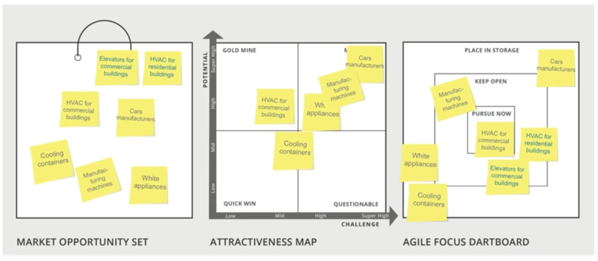

# Week 4 - How to design your Agile Focus Strategy

- [4.1 - Introduction- the Agile Focus Dartboard](#4.1---introduction--the-agile-focus-dartboard )
- [4.2 - Choosing your Primary Market Opportunity](#4.2---choosing-your-primary-market-opportunity)
- [4.3 - Building a smart portfolio](#4.3---building-a-smart-portfolio)
- [4.4 - The outcome- your Agile Focus Dartboard](#4.4---the-outcome--your-agile-focus-dartboard)
- 4.5 - Wrap up

## 4.1 - Introduction- the Agile Focus Dartboard 

### This week: overview and goals
Overall, our learning goals for this week are:

- Understand the focus - flexibility tradeoff, and how the Agile Focus strategy can help you to achieve the critical balance between them.
- Learn how to analyze the attractiveness map and choose your primary market opportunity, to make sure that you are running in the right direction.
- Learn how to select the backup and growth options that you will keep open, to mitigate your risk and increase your value with minimum effort.

### 4.1.2 - The innovator's challenge: focus and stay agile
Once You understand the value of your opportunities, what market opportunities should you focus on?

A fundamental decision with fundamental implications: 
1. Market Choice is key for creating value and obtaining revenues
2. Market Choice is imprinting the DNA of your venture: culture, organization identity, who you are as organization, kind of people you are going to hire, type of customers
3. Yet...you may need to adapt your choice over time => Focus and Agility

A smart market opportunity strategy has to take into account:
- WHAT are the most attractive market opportunities that you should focus on?
- HOW can you focus and stay flexible, agiel and open-minded at the same time?

**The Agile Focus Strategy** is your way to combine this tow aspects to set an optimal strategy that reaps the greatest benefits from your commercialization efforts.

It balances the tension between focus and flexibility by consciously keeping other opportunities open: those that will allow you to (i) mitigate your risk and (ii) increase your value with minimum effort.

This strategy enables you to leverage your resources and capabilities, so that you allocate them more effectively and avoid a potentially fatal lock-in.

#### Core implications of the Agile Focus Strategy
Allows you to manage your venture with foresight while remaining agile. It supports you in:
- Allocating your resources and developing your technology
- Picking and developing your team and your stakeholders
- Managing your intellectual property
- Building your organizational identity and culture
- Defining your branding and marketing messages

Is about creating a smart portfolio around the most attractive opportunity to enhance agility

### 4.1.3 What we will learn this week
- Understand the major considerations for choosing your Primary Market Opportunity
- Understan which options are suitable for growth, or for backup
- Desing your Agile focus strategy

#### The Market Opportunity Navigator - 3rd Step
Agile Focus Dartboard
- Pursue Now
- Keep Open
- Place in Storage

#### Agile Focus Strategy
- Why is it important? it enables you to hedge your risks and to leverage your competences at the same time, thus allocating your resources more effectively and avoiding a potentially fatal lock-in. It has significant implications for how you build and design your venture.

- How  is it done? choose your Primary Market Opportunity and analyze which other options are suitable for growth, or backup, based on their attractiveness and their relatedness to your primary market.
Decide which options should be pursued in parallel, kept open for later, or put aside for now.

#### The Agile Focus Dartboard
Define your Agile Fous Strategy:
- the market opportunities that you pursue now
- The opportunities that you keep open as growth or backup options
- The opportunities that you place in storage

Worksheet 3 - Design Your Agile focus Strategy

#### The main take-aways from this step
- Designing a smart portfolio actually helps you build and maintain your cognitive flexibility.
- Don't rush your focus decision: take your time to investigate and to make careful decision
- Letting go of potentially interesting opportunities is often the most painful part
- There is rarely a 'perfect' market opportunity

#### 4.1.4 Discussion prompt: Pursuing opportunities in parallel

## 4.2 - Choosing your Primary Market Opportunity
### 4.2.1 - Different scenarios of the Attractiveness Map

#### Designing your Agile Focus Strategy
The design begins with choosing your `Primary Market Opportunity`
Once this is set, you can start planning your smart portfolio of growth and backup options.
The `Primary Market Opportunity` is the option that you want to focus on: the one that you will pursue with full force, investing most of your resources and capabilities in conquering it.

> If you pick all of your market opportunities you are spreading your resources too thinly, you're not getting any traction with any of the market opportunities that you're trying to pursue.

To make a smart choice, you first need to examine the Attractiveness Map, and utilize all the knowledge that you have gathered from the evaluation process.

#### Common patterns of the Attractiveness Map
- `One Clearly Superior Opportunity`: If you have a single opportunity located in the `Gold-Mine` quarter, your choice is relatively easy. Other less attractive opportunities may still be important, as they may serve as your growth or backup options.
- `Diagonal Trade-off`: your options are spread along the "risk-return" diagonal. A preferred market opportunity in this case is not readily apparent. You can choose to begin with a Quick Win, which would serve as a stepping stone for a more significant option in the future, or you can choose a Moon Shot from the very beggining.
- `Options are all Closely Located`: all situated in the same quarter, or they are all be scattered around the middle. In these cases, the best option is not apparent, as opportunities are not too distinctive in terms of their Potential and their Callenge. Choosing depends on our personal preferences or on specific factors in Worksheet 2.
- `No attractive Options`: If all your options are located in the Questionable quarter, you could either try to identify additional market opportunities, or think about how to shape one of your options to improve its location on the Attractiveness Map. Try not to choose a Questionable option as your Primary Market Opportunity.

### 4.2.2 Other considerations for choosing your Primary Market Opportunity
- `Personal fit with the opportunity`: The opportunity should match your personal preferences: your values, your passion, your aspirations, and even your attitude towards risk taking.
Choose a market opportunity that you love, and will continue to love as your venture grows and evolves.
- `Fit with stakeholders' interest`: Key stakeholders, such as current investors or existing partners, may have incentives and interests that are not completely aligned with yours, but have to be considered when choosing your Primary Market Opportunity.
- `Resource constraints`: Sometimes you just have to start with a Quick Win, simply because you don't have the resources to pursue a larger, more challenging opportunity.
Add your current financial and human capital to the equation when choosing your Primary Market Opportunity.
Also consider the resources that you may be able to attract, like venture capital.

#### Dont' rush making this profound decision
At some point, however, you have to focus...How do you know that this time has arrived?
- When learnin reaches a point of saturation: You're doing more customer interviews or collecting more information but you're just not learning more, this is a clear point that a decision is ripe to be made.
- When you are running out of money: You have to raise funds from investors.
- When you have to invest in branding

#### Augury Example
Set and Attractiveness Map

#### Few Tips for Making this Profound Decision
- There is no perfect option
- Make it a team decision (you need them full onboard in this major decision)

## 4.3 - Building a smart portfolio

### 4.3.1 - The portfolio logic

#### Keping options open...What does it mean?
Relatively low investments that will make your firm more robust to change, without losing your focus. For Example:
- Develop a modularized technology that can be reconfigured more easily
- Cast a wider Intellectual Property net
- Pick a brand name that would lend itself for redirection, etc.

> In short, develop your resources and capabilities in a way that allows for greather flexibility down the road.

#### Creating a smart portfolio
Need to keep open at least one Backup option and one Growth option.

- A `Backup Option` is an attractive market opportunity that does not share the same major risks of your Primary Market Opportunity or rely on the same major assumptions. It allows you to change direction over time, if necessary.
Is a plan B, it answer the question "If we are not successful, what shall we do next?"
- A `Growth Option` is an attractive market opportunity that allows you to create additional value over time.
It answer the question "If we are successful, what shall we do next?"

Backup and Growth options should ideally be closely related to your Primary Market Opportunity. Product & market relatedness will allow you to leverage your existing resources, capabilities and relationships - thereby increasing your value creation and balancing your risk with minimum effort.

#### Designing your Agile Focus Strategy
You can:
- Keep your backup and growth options open, or
- Decide to pursue them now, parallel to your Primary Market Opportunity

This investmet decision depends on the additional effort that is required for pursuing the options, and how critical they are for your success.
parallel pursuit of opportunities means that you are allocating attention on multiple targets, which by definition means you are spreading yourself more thinly across these two options. But if they are closely related this might be actually durable because they share resources, capabilities, and other elements, networks and they require less attention from you.

### 4.3.2 - Candidates for Backup and Growth options
#### Examining Possible Backup and Growth Options
To identify possible candidates for your smart portfolio, go back to the Attractiveness Map and the evaluations you have done in Worksheet 2.
Pick other attractive market opportunities that you would like to consider in more detail as your candidates.

You can also consider additional market opportunities that originally were not placed in your set of options, but that now - after you have chosen your Primary Market Opportunity - appear to be interesting options as they are related to your main market.

#### List your candidates in Worksheet 3
In the second line. Next you will assess product and market relatedness

#### Assessing Relatedness to your Primary Opportunity
Relatedness of two market opportunities means that you can effectively leverage the resources, capabilities and relatioships that you are developing for one opportunity for succeding in the other.
The more related your options are to your Primary Market Opportunity, the less effort will be required to keep them open.

Two types of relatedness need to be examined:
- `Product Relatedness` is the extent to which the development of the two products requires similar resources and capabilities.
- `Market Relatedness` is the extend to which the marketing and distribution of the two products requries similar resources and capabilities

#### Assesing Product Relatedness
To what extent do the products share...
- Technological competences? (i.e., the functions and features of the products rely on similar technolgical developments)
- Required resources? (i.e., employees, manufacturing equipment, intellectual property, etc.)
- Necessary networks? (i.e., suppliers, partners, or other members of the value chain)

Use the circles: not related, some, strong

#### Assesing Market Relatedness
To what extend do the customers share...
- Values and benefits? (i.e., you can leverage your brand and reputation from one market to the other)
- Sales channels? (i.e., you can utilize the same distribution channels for both markets)
- Word of mouth? (i.e., satisfied customers in one market can promote your product in the other)

Use the circles: not related `low`, some `medium`, strong `high`

#### Which Opportunities are suitable as Backup Options?
Use the Attractiveness Map and the evaluations you have done in Worksheet 2 to think about the major risks and potential show stoppers associated with your Primary Market Opportunity

#### Which Opportunities are suitable as Growth Options?
Allows you to increase your value creation potential.
They should be as attractive as possible (with high potential and low challenges) and as closely related to your primary opportunity, so that pursuing them will require limited additional effort.

#### Growth and Backup Options?
Sometimes, an opportunity can serve as your backup option and also as your growth option.
This is the case if your Market Opportunity Set includes an attractive opportunity that is highly related to your primary market opportunity, but does not share the same major risks with it. This can be either a backup or a growth option

#### Augury's example
Primary Market Opportunity: HVAC for commercial buildings (Pursue Now)

candidates for Backup and Growth
Design  Your Agile Focus Strategy: Augury  
HVAC for commercial buildings  
- HVAC for residential buildings: PR `high` - MR `medium` - Growth
- Elevators for commercial buildings: PR `medium` - MR `high` - Growth
- Manufacturing machines:  PR `medium` - MR `medium` - Backup

### 4.3.3 - How to allocate your resources among options
#### Finalizing your Agile Focus Strategy
- Which of the assessed market opportunities will eventually serve as your Backup option and as your Growth option? it will help you to prepare for an uncertain future. Attractiveness vs relatedness, relatedness vs risk balancing.
- How much effort are you planning to invest in these options in the near future?

Once you make these decisions, you will be able to determine which market opportunities will you:
- [many] Pursue now
- [midd] Keep open for later
- [none] Place in storage

[Investing Resources and Attention]

Combining all of these important considerations will enable you to do exactly what the Agile focus Strategy is all about: focus on the most attractive market opportunity while maintaining your agility.

#### Keeping options open
Allocate little resources and attention to keep this opportunity 'breathing', and not to lock yourself out of it:
- stay informed
- Build flexible resources and capabilities; thinks that you can do today to be more agile in the future
- Develop an appropiate identity: brand, organization identity

These relatively low investment will make your firm more robust to change, without compromising the pursuit of your Primary Market Opportunity.

#### Pursue options now, in parallel
Allocate your resources and attention to pursue both markets simultaneously and to develop the required skills and expertise for succeeding in both.
Two major considerations should guide your decision:
- How critical is this option to your venture's preformance? Maybe one Market Opportunity is not enough.
- How related is this option to your Primary Market Opportunity? Avoid the risk of spreading yourself.

#### Placing options in storage
Do nothing about them, for now, only keep them in the back of your mind:
- These options can become relevant someday, either for you to pursue, or for licensing to others
- can be stored as long as you wish

#### Augury's example

## 4.4 - The outcome- your Agile Focus Dartboard

### 4.4.1 - Placing your opportunities on the Dartboard
Depicts your strategy to discuss it with team members, employees and other stakeholders.

#### Augury's Agile Design

  

The Market Opportunity Navigator is designed to be a dynamic tool. Therefore, you can add or dismiss options as you move forward with your learning and buil your understanding.

## 4.5 - Wrap up Assignment 

>>
Section outline
Video: Flyability example
Video: Common questions
Summary and main take-aways
Assignment 3
Download Worksheet 3
Your feedback
