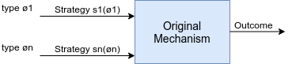
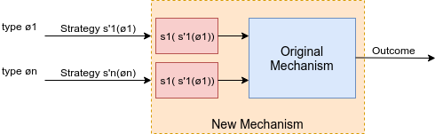

# Week 2 - Mechanism Design

Content:  
[2.1 Mechanism Design: Taste](#21-mechanism-design-taste)  
[2.2 Implementation](#22-implementation)  
[2.3 Mechanism Design: Examples](#23-mechanism-design-examples)  
[2.4 Revelation Principle](#24-revelation-principle)  
[2.5 Revelation Principle: Examples](25-revelation-principle-examples)  
[2.6 Impossibility of General Dominant-Strategy Implementation]()  
[2.7 Transferable Utility]()  
[2.8 Transferable Utility Example]()  
[2.9 Mechanism Design as an Optimization Problem]()  
[Quiz]()  
[Reading on the theory of Mechanism Design]()  
[2.1 Mechanism Design: Taste]()  

Instead of taking the game as given and trying to analyze it, we'll look at situations where we have some idea of what we'd like to see be the outcome and then the question is, can we design a game that will yield that outcome? And so, can we design institutions?
Can we design a system to efficiently mediate bargaining?
Can we avoid wasting resources and energy by designing the game?

Central question in Mechanism Design: When is it that we can get socially efficient outcomes?

## 2.2 Implementation

In this segment, we introduced a very central area of game theory called **Mechanism Design**. It's often called **implementation theory*- and sometimes also called **inverse game theory**.

In mechanism design, we get to design the game so as to optimize for certain qualities.

### Bayesian Game Setting

All the background that we don't get to control (candidates, voters, preferences, type, information) is called the setting or the Bayesian game setting.

Given a Bayesian game setting which won't quite be a game. It will be a setting, a then we'll add to it the ingredients that will turn it into a game. And we'll try to design the game so as to optimize certain qualities.

- Extend the social choice setting to a new setting where agents can't be relied upon to disclose their preferences honestly.
- Start with a set of agents in a Bayesian game setting (but no actions).

Definition:  
A **Bayesian game setting*- is a tuple (`N,O,Ø,p,u`), where

- `N` is a finite set of n agents;
- `O` is a set of outcomes;
- `Ø` = Ø1 x...x Øn is a set of possible join type vectors; (private information: types of the agents)
- `p` is a (common prior) probability distribution on Ø; (known by the agent)
- `u` = (u1,...1n), where `ui: OxØ -> R` is the utility function for each player i; (a candidate elected will give me some utility)

This is all the setting that we, as mechanism designers, do not get to control, and don't have access to. We know perhaps who the agents are, we don't know their types. We may know their common prior on those types.

### Mechanism Design

Definition:  
A `mechanism` (for a Bayesian game setting (`N,O,Ø,p,u`)) is a pair (`A,M`), where:

- A = A1 x...x An, where Ai is the set of actions available to agent i E N;
- M: `A-> D(Ø)` maps each action profile to a distribution over outcomes.

Thus, the designer gets to specify:

- the action sets for the agents
- the mapping to outcomes, over which agents have utility
- can't change outcomes; agents' preferences or type spaces

A mechanism consists of those things that when added to the **Bayesian game setting*- would make for a **Bayesian game**: the actions and how they map to outcomes.

### What we're up to

So how do you specify the mechanism?

- The problem is to pick a mechanism that will **cause rational agents to behave in a desired way**
  - each agent holds a private information, in the Bayesian game sense
- Various **equivalent*- ways of looking at this setting
  - perform an optimization problem, given that the values of (some of) the inputs are unknown
  - choose the Bayesian game out of a set of possible Bayesian games that maximizes some performance measure
  - design a game that implements a particular social choice function in equilibrium, given that the designer no longer knows agents' preferences and the agents might lie

### Implementation in Dominant Strategies

Definition:  
Given a Bayesian game setting (`N,O,Ø,p,u`), a mechanism (`A,M`) is an `implementation in dominant strategies` of a social choice function `C` (over `N` and `O`) if for any vector of utility functions `u`, the game has an equilibrium in dominant strategies, and in any such equilibrium `a*` we have  
`M(a*) = C(u)`.
> we have that the outcomes specified by the mechanism is indeed a social choice function.

### Implementation in Bayes-Nash equilibrium

Definition:  
Given a Bayesian game setting (`N,O,Ø,p,u`), a mechanism (`A,M`) is an `implementation in Bayes-Nash equilibrium` of a social choice function `C` (over `N` and `O`) if there exists a Bayes-Nash equilibrium of the game of incomplete information (`N,A,Ø,p,u`) such that for every type `ø` E `Ø` and every action profile `a` E `A` that can arise given type profile `ø` in this equilibrium, we have that  
`M(a) = C(u(.,ø))`.
> It's the case that the outcome defined by that action profile is a social choice function of the agents given their types.

In dominant strategies, the situation is simple. We simply gave dominant strategies and we require that in all of those the action profile lead to a social choice function.  
Here we have probability distributions and so there could be multiple actions that instantiate these action profile, these strategies. And what would be the case that every action profile would lead up, by definition, to some outcome.

### Bayes-Nash Implementation Comments

Bayes-Nash Equilibrium **problems**:

- there could be more than one equilibrium
  - which one should I expect agents to play?
- agents could mis-coordinate and play none of the equilibria
- asymmetric equilibria are implausible

**Refinements**:

- Symmetric Bayes-Nash implementation
- Ex-post implementation (agents don't experience regret)

### Implementation Comments

We can require that the **desired outcome arises**

- in the only equilibrium
- in every equilibrium
- in at least one equilibrium

Forms of implementation:

- **Direct Implementation**: agents each simultaneously send a single message to the center (voting one candidate)
- **Indirect Implementation**: agents send a sequence of messages; information may be (partially) revealed about the messages that were sent previously (voting with elimination)

Direct implementations will turn out to be quite universal in what they can accomplish. And much easier to analyze than indirect implementation and so for theoretical investigation purposes at least, they are quite central.

## 2.3 Mechanism Design: Examples

### Bayesian Game Setting: Voting Examples

- N = {1,2...n} is a committee of voters;
- O = {a,b,c}, the outcomes, are candidates who could be elected;

### Types and Utility functions

- This example has **private value**: the agent's own type `Øi` fully captures the preferences of the agent:
  
  - `~Øi` has utility 3 for *a*, 2 for *b*, and 1 for *c*
  - `u(o,~Ø)` depends only on `Øi` (the outcome depends only on the person's own type)
  - `u(a,~Øi)` = 3, `u(b,~Øi)` = 2, `u(c,~Øi)` = 1 (private values)

- `Øi` is the same for all `i` and is `{~Øi,^Øi,-Øi}` where:

  - `~Øi` has utility 3 for a, 2 for b, 1 for c
  - `^Øi` has utility 3 for b, 2 for a, 1 for c
  - `-Øi` has utility 3 for c, 2 for a, 1 for b

### Probabilities

- Types are independent across agents:

  - p = .49 of `~Øi`  (like a the best)
  - p = .49 of `^Øi`  (like b the best)
  - p = .02 of `-Øi`  (like c the best)

### A Plurality Voting Mechanism (M)

- A = A1 x...x An, where Ai = {a,b,c} (A = announcements)
- M : A -> Þ(O):  (Þ(O) = choice of outcomes)
  
  - picks the candidate named by the most agents (e.g. M(b,b,c)=b)
  - if there is a tie, then picks among those getting the most votes uniformly at random (M(a,b,c) pick each candidate with probability 1/3)

### No Dominant Strategies

- Suppose that n is odd and at least 5, and consider type `-Øi` who has utility 3 for c, 2 for a, and 1 for b.

  - if half of the other players vote for a and half for b, then best off voting for a
  - if half of the other players vote for c and half for a, then best off voting for c
  > So what this tells us is that how this person votes actually depends on what they're thinking the other people in the society are going to do. No dominant strategy in this kind of game.

- Optimal action depends on what think others will do.
- what if n = 3?

### Many Bayes-Nash equilibria

Suppose that n is odd and at least 5:

- All vote for candidate a is an equilibrium
- All vote for candidate b is an equilibrium (not sensible?)
- A 'two candidate' equilibrium (see 'Duverger`s Law'):
  
  - `~Øi` votes a
  - `^Øi` votes b
  - `-Øi` (utility 3 for c, 2 for a, 1 for b) votes a (c is a wasted vote)

  > Duverger's law in the political science literature. And it refers to the fact that plurality systems of this type often result in basically, only having two viable candidates. Because you realize that if there's a third candidate who has a low probability of being elected, you're better off casting your vote for one of the two candidates who are really in contention. And that focuses all the attention on two candidates, and it's really hard for a third candidate to enter and have any chance of winning.

### One Possible 'Direct Mechanism' for Plurality Rule

Direct Mechanism: where people were not reporting their preferences. What they were reporting was an actual vote.

- Voter states type in `{~Øi,^Øi,-Øi}`
- Mechanism translates type announcement into vote for favorite candidate:

  - saying `~Øi` is as if voting for a
  - saying `^Øi` is as if voting for b
  - saying `-Øi` is as if voting for c

### Manipulation of that 'Direct Mechanism' for Plurality Rule

- If others are truthful, then type `-Øi` would prefer to vote for a, so lies to `~Øi`

## 2.4 Revelation Principle

One of the core ideas that makes mechanism design possible.

### Revelation Principle

- It turns out that any social choice function that can be implemented by any mechanism can be implemented by a **truthful**(write down the type) and **direct**(act based on the information) mechanism!
- Consider an arbitrary, non truthful mechanism
  - may be indirect (sequence of actions and information)
- Recall that a mechanism defines a game, and consider an equilibrium `s = (s1,...,sn)`

- We can construct a new **direct** mechanism, as above
- This mechanism is truthful by exactly the same argument that `s` was an equilibrium in the original mechanism
- **The agents don't have to lie, because the mechanism already lies for them.**

> The mechanism is acting kind of as my proxy. The mechanism is doing just what I would like to do. If only I tell it the right thing. And so I should tell it the right thing. That's the idea of the revelation principle.

### Discussion of the Revelation Principle

- The set of equilibria is **not always the same** in the original mechanism and revelation mechanism
  - of course, we've shown that the revelation mechanism does have the original equilibrium of interest
  - however, in the case of indirect mechanism, even if the indirect mechanism has a unique equilibrium, the revelation mechanism can also have new, bad equilibria
- So what is the revelation principle **good for**?
  - recognition that truthfulness is not a restrictive assumption
  - recognition that indirect mechanism can't do (inherently) better than direct mechanisms
  - for analysis purposes, we can consider only truthful mechanisms, and be assured that such a mechanism exists

## 2.5 Revelation Principle: Examples

## 2.6 Impossibility of General Dominant-Strategy Implementation

## 2.7 Transferable Utility

## 2.8 Transferable Utility Example

## 2.9 Mechanism Design as an Optimization Problem

## Quiz

## Reading on the theory of Mechanism Design
