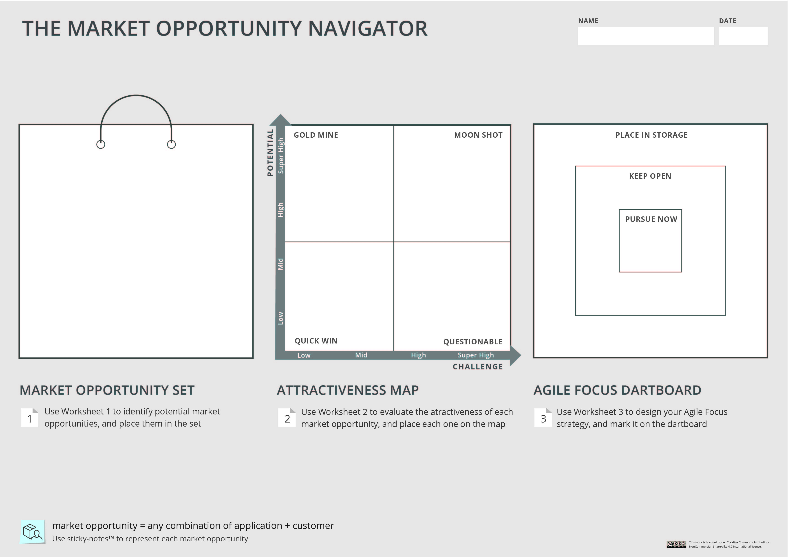

# Week 1 - Introduction

## 1.1 Welcome

One of the most profound decision for entrepreneurs and innovators: Which market to play in?

The Market Opportunity Navigator will help you
- Discover promising market opportunities
- Evaluate their value
- Set your strategy focus smartly

To make sure that you are running in the right direction & remaining agile wothout losing your focus

## 1.2 Introducing the Market Opportunity Navigator
Market choice - What can go right...and wrong?

### Why? 
1. Your choice of market opportunity will influence your chances for success; it will influence how you get traction in he market, how you gain profits, and how you create value for your firm

2. The decision imprints your venture or your innovation process, will shape other decisions that you will take over time and that then put your in a certain trend channel or path. and this will actually be very difficult to undo if you need to change direction.

Forbes: "Understanding where to focus is a real dilemma for entrepreneurs". Firms rarely fails because their teams don't work hard enough,  but they fail because their teams actually works on the wrong things.

### Why is a difficult decision?
- There is always uncertainty: is inherent to the innovation process (known unknowns and unknown unknowns )
- There are always trade-offs: big markets growing slow, small markets protected, etc
- Markets are constantly changing

Making the right market opportunity choiceis definitely the key for creatingsignificant value and success.

### What can go wrong?
1. Focusing on the wrong market opportunity. Before you start running fast, make sure you are running in the right direction
2. Improper balance between focus and flexibility
    - Startups must focus sharply if they want to win the race
    - Startups must stay flexible if they want want to win the race

> Don't get trapped!: If you are lightning focused on just one thing and aren't willing to consider others, you probably don't have the flexibility to make it when your things don't go according to plan" - Stephen Kaufer, cofounder tripAdvisor

Make sure not to lock yourself into one specific direction
- How can I identify blockbuster opportunities? Did I miss out any?
- How do I know what's the most valuable option for us?
- How can I let go of seemingly promising opportunities?
- As market choice is so important - how can I hedge my bets?

### The Market Opportunity Navigator in a nutshell
3 steps for discovering and strategising your most valuable market opportunities
1. Search Broadly: Which market opportunities exists for us? Generate your **Market Opportunity Set**
2. Assess Deeply: What are the most attractive market opportunities for us? Create your **Attractiveness Map**
3. Strategise Smartly: what market opportunities should be focus on? Design your **Agile Focus Dashboard**

3 dedicated worksheets, that leads to the 3 important outcomes

### Step 1: Market Opportunity Set
The set of potential market opportunities taht you can address with your core resources and capabilities. These can be varied options, related to different types of needs for different types of customers.
A varied set of market opportunities is an asset in and of itself!

Worksheet 1 will guide you through this process
The outcome: your Market opportunity set

### Step 2: Atractiveness Map
Visually depict the evaluation of your market opportunities - based on their Potential and their Challenge - so you can better grasp their upsides and downsides, and compare them with each other.
Make an informed choice that relies less on intuition and suffers less from biases

Worksheet 2 will guide you through this process
The outcome: your Attractiveness Map

### Step 3: Agile Focus Dartboard
The Dartboard depicts your Agile Focus Strategy, and clearly defines the opportunities that you will oursue now, and those that you will keep open for backup or future growth. 
This allows you to mitigate your risk and increase your value with minimum effort!

Worksheet 3 will guide you through this process.
The outcome: your Agile Focus Dartboard

### Remember: this is a learning process
- Appreciate the process, not just the outcome
- Test your assumptions and turn them int oknowledge
- Make it as iterative as possible
- Debate as much as you can
- Make it a habit

## 1.3 Applying the Market Opportunity Navigator

### Complementing other business tools
Specifically, the Navigator is designed to work seamlessly with:
- the Business Model Canvas and the Value Proposition Canvas: outstanding frameworks for planning your strategy
- The Lean Startup Metodology: a key method for validating your strategy

Togheter, they form a powerful "Suite of Tools" that clearly lays out the planning and validation processes, as you strive to find your promising path!

#### The Business Model & Value Proposition Canvases
Valuable frameworks that help you plan your strategy in order to create value for your customers and for your firm.
The navigator, which provides the macro view of the landscape of opportunities, adds an essential level of analysis to the micro-planning of the Canvases.

#### The Lean Start-up Methodology
Important validation process for discovering and developing customers through rapid build-measure-learn cycles.
The navigator provides an on-going tool for planning, reflecting and adjusting as you go through rapid Lean cycles of learning, and makes sure that you will always keep track of the broad picture in addition to the path that you are currently testing.

### Different use cases
- Supporting your market choice
- Its possible to start from different entry points
- for technology push and market pull categories
- Initial market choice and over time:
  - Trace back, track and update your decision
  - Navigate the pivoting process
  - Navigate the growth process

### Market Opportunity Navigator

  

## 1.4 Practical information

### Case study introduction - meet Flyability
aims at becoming the leader in this segment of flying robotics, and be at the forefront of innovation to continuously deliver value, safety and fun to its customers.

### Common questions
